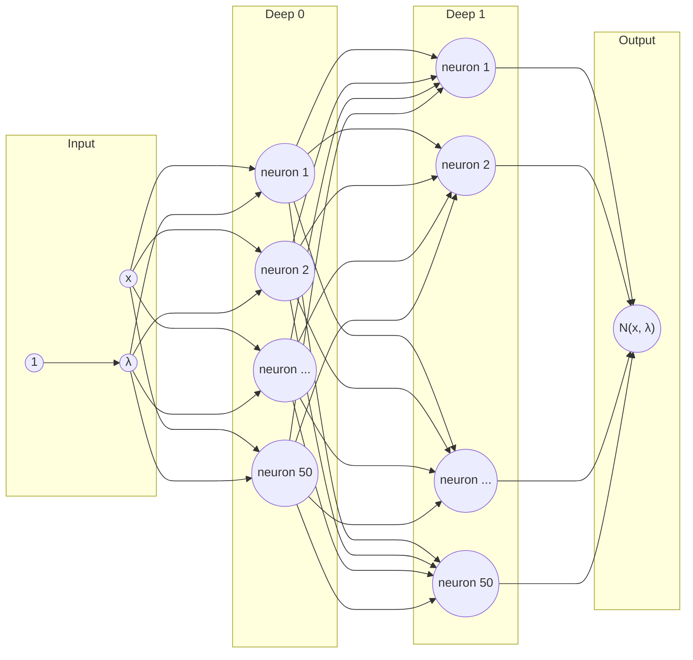

# Introduction for Quantum Oscilator problem

The goal of this project was not so much to implement the network itself, but
to verify how efficiently differential equations with an eigenproblem can be
solved using neural networks. Unfortunately, as a result of this experiment, we
came to the conclusion that the process of learning network is too
time-consuming and in this form can not be applied to other problems that we
considered as a target.

As sad as it sounds, we leave the implementation of the network for all
interested parties to see. On the other hand, we ourselves are changing the
space of our interest from equations with an eigenproblem to equations without
one.

## Maths behind the problem

Consider a mathematical problem of the following form

##### Equation 1

$$
\mathcal{L}f(x) = \lambda f(x)
$$

- $x$ a variable
- $\mathcal{L}$ is a differential operator which depends on $x$ and its
  derivatives
- $f(x)$ is the eigenfunction
- $\lambda$ is the eigenvalue associated with eigenfunction

##### Network input-output

Our neural network in form of represented by $N(x, \lambda )$ is expected to
get two values as input:

- $x$ - single floating point value within $x_L$ to $x_R$ range
- $\lambda$ - eigenvalue approximation selected by neural network

As output, we also expect two values:

- $y$ - floating point value corresponding to single $x$ value within $x_L$ to
  $x_R$ range - $f(x)$ approximation
- $\lambda$ - eigenvalue approximation selected by neural network

To use our neural network as a proxy for $f(x)$ we need to put the values
returned from it into the equation below

##### Equation 2

$$
f(x,λ) = f_b + g(x)N(x,λ)
$$

- $f_b$ arbitrary constant
- $g(x)$ [boundary condition](/quantum_oscilator/introduction/#equation-3)
- $N(x, \lambda )$ - our neural network

##### Equation 3

$$
g(x) = (1 −e^{−(x−x_L)})(1 − e^{−(x−x_R)})
$$

- $x_L$ minimum (left) value in the examined range
- $x_R$ maximum (right) value in the examined range

## Loss function

##### Equation 4

$$
\mathcal{L}f(x) - λf(x) = 0
$$

By rearranging [Equation 1](/quantum_oscilator/introduction/#equation-1) to
form [Equation 4](/quantum_oscilator/introduction/#equation-4) we are able to
use it to measure how far from exact eigenfunction and exact eigenvalue is
current state of neural network. We are replacing $f(x)$ with
[$f(x, \lambda )$](/quantum_oscilator/introduction/#equation-2) and using
$\lambda$ retuned from network.

Therefore without any prepared input data, just based on loss function and back
propagation we can move from a random state of network to an approximation of
the equation solution.

## Regularizators

To teach a neural network multiple solutions to a given equation, it is
necessary to add additional components to the cost function that will prevent
the neural network from staying with trivial solutions and force transitions
between successive states.

##### Equation 5

$$
L_f = \frac{1}{f(x, \lambda )^2}
$$

$$
L_{\lambda} = \frac{1}{\lambda^2}
$$

Those values forces network to avoid learning trivial solutions.

##### Equation 6

$$
L_{drive} = e ^ {-\lambda + c}
$$

- $c$ - variable increased in regular intervals

This value forces network to look for other solutions to given problem.

## Network structure

The network is a simple sequential model. The only unusual thing is returning a
value from the lambda layer which is also the input to the network. This value
is necessary to calculate the value of the loss function, and getting it in any
other clever way spoils the whole learning process.

