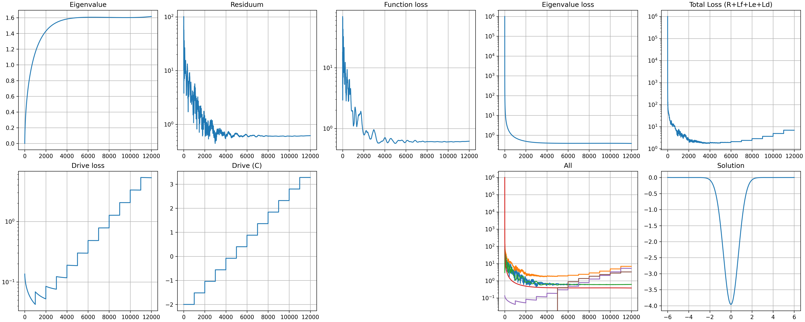

# How to run QONetwork learning cycle

To run learning cycle, first you have to instantiate QOConstants object
containing parameters of QONetwork and QOTracker for tracking learning process
metrics.

```python
constants = QOConstants(
    k=4.0,
    mass=1.0,
    x_left=-6.0,
    x_right=6.0,
    fb=0.0,
    sample_size=1200,
    tracker=QOTracker(),
)
```

Then you have to instantiate QONetwork object

```python
network = QONetwork(constants=constants)
```

And after above steps you can run learning loop

```python
for index, nn in enumerate(
    network.train_generations(
        QOParams(c=-2.0, c_step=0.16),
        generations=150,
        epochs=1000,
    )
):
    pass
```

After each generation of learning, body of loop will be executed, thus you can
stuff any kind of plotting there.

**For example you can use QOTracker.plot() (see full code snippet at the very
bottom)**

<figure markdown>
  { width="1000" }
  <figcaption>Example learning graph created using QOTracker.plot()</figcaption>
</figure>

Full code snippet:

```python

```
